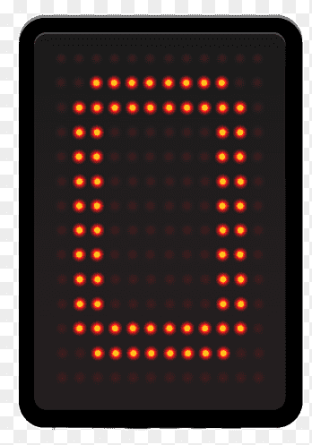
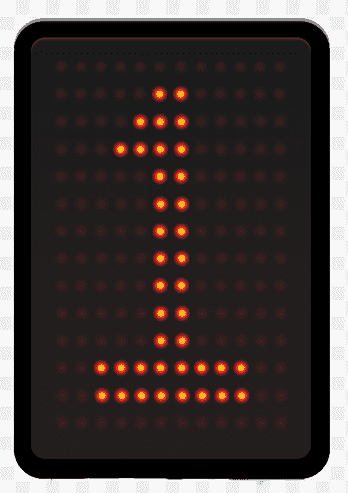
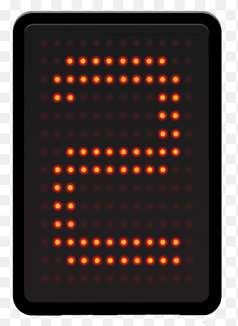
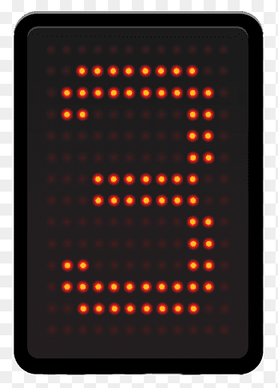
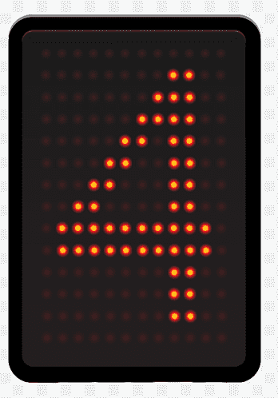
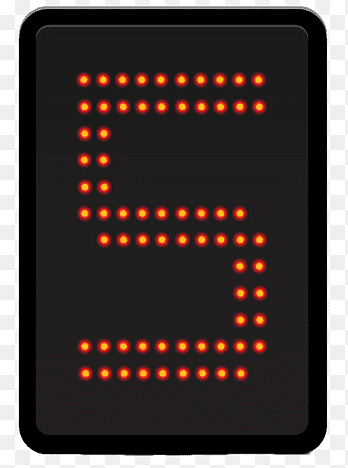
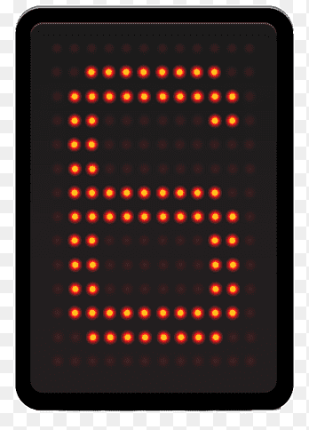
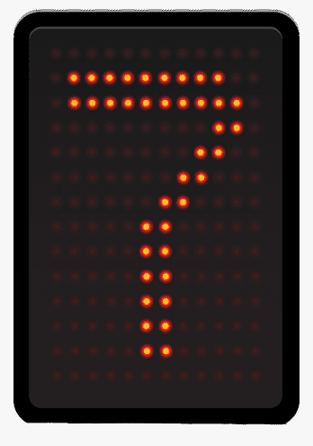
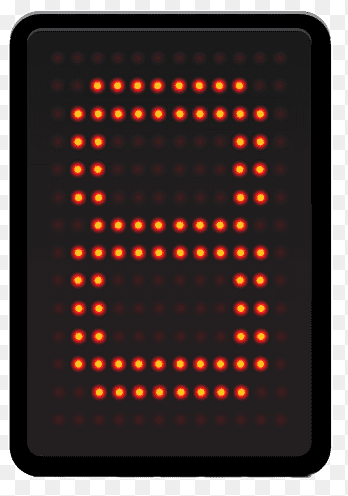
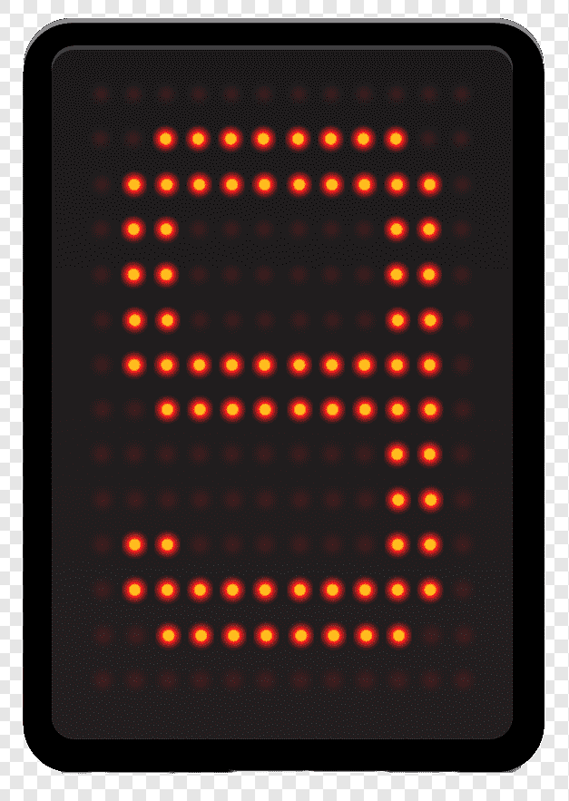

# Futbolín con Físicas

Este proyecto genera un **futbolín en 3D completamente interactivo**, donde **dos jugadores pueden competir en tiempo real**.

---

## Contenidos

- [Estructura del Proyecto](#estructura-del-proyecto)
- [Descripción de los ficheros](#descripción-de-los-ficheros)
- [Controles](#controles)
- [Vídeo de Demostración](#vídeo-de-demostración)

---

## Estructura del Proyecto

```txt
/src
 ├── index.js      → Entrada principal del proyecto
 ├── scene.js      → Creación del escenario, jugadores, barras y marcador
 ├── physics.js    → Sistema completo de físicas con Ammo.js
 ├── ball.js       → Lógica de la pelota y disparos
 ├── goal.js       → Detección de goles y sistema de puntuación
 └── assets/       → Texturas, imágenes y números del marcador
```

---

##  Descripción de los ficheros

### `index.js`

- Inicializa **Three.js**, cámara, luces y controles.
- Inicializa el motor de físicas (**Ammo.js**).
- Lanza el **bucle de animación**.
- Gestiona la **entrada del teclado** para mover y disparar.
- Sincroniza físicas y renderizado.
- Permite seleccionar la barra activa de cada jugador.

---

### `scene.js`

- Crea:
  - Campo de juego
  - Bordes y porterías visuales
  - Equipos A y B
  - Barras
  - Marcadores

 Campo de juego y jugadores:

 
  
---

### `physics.js`

- Inicializa el **mundo físico** con gravedad.
- Crea:
  - Suelo del campo
  - Muros laterales
  - Porterías físicas
  - Suelo del gol
  - Cuerpos físicos de los jugadores
- Actualiza:
  - Posiciones físicas
- Controla:
  - Rebotes de la pelota
  - Límite de altura
  - Inicio del movimiento

Física de la pelota y los jugadores:


---

### `ball.js` 

- Crea la pelota con masa, fricción y rebotes
- Añade un disparo automático aleatorio al tocar el suelo y un impulso por golpear los límites del campo
- Detecta si la pelota se queda quieta más de 5 segundos y la reinicia
- Incluye botón **Reset Ball** para reiniciarla en caso de que se quede atascada

---

### `goal.js` 

- Detecta cuándo la pelota entra en una portería.
- Actualiza el marcador con texturas numeradas.
- Muestra un gif de gol.
- Reinicia la pelota tras cada gol.

Animación de gol:


Marcadores numéricos:

<table align="center">
  <tr>
    <td></td>
    <td></td>
    <td></td>
    <td></td>
    <td></td>
    <td></td>
    <td></td>
    <td></td>
    <td></td>
    <td></td>
  </tr>
</table>
---


##  Controles

### Jugador A

| Tecla | Acción |
|-------|--------|
| `A` | Seleccionar barra anterior |
| `D` | Seleccionar barra siguiente |
| `W` | Mover barra a la derecha |
| `S` | Mover barra a la izquierda |
| `ESPACIO` | Disparar |

---

### Jugador B

| Tecla | Acción |
|-------|--------|
| `←` | Seleccionar barra anterior |
| `→` | Seleccionar barra siguiente |
| `↑` | Mover barra a la derecha |
| `↓` | Mover barra a la izquierda |
| `ENTER` | Disparar |

---


## Vídeo de Demostración

https://drive.google.com/file/d/12j--PjEVjP4b9Ivr1q_tbOFdU4l6AzQj/view?usp=sharing

### Enlace al CodeSandbox:

https://codesandbox.io/p/sandbox/charming-dewdney-s3pgrz

Saúl Expósito Morales
